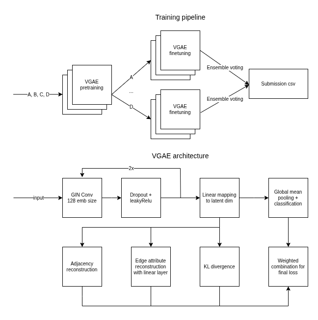

# Deeplearning Hackathon

## Teaser 

## Solution architecture

Our solution was inspired by: https://github.com/cminuttim/Learning-with-Noisy-Graph-Labels-Competition-IJCNN_2025

### Graph encoders

In order to add unsupervised parts to our loss function, which would not depend on the noisy labels and hopefully help reduce the effecto of noise, we used a graph encoder, namely a VGAE. This enabled us to add 3 new terms to our loss: edge label reconstruction loss, edge predictin loss and KL divergence. 

The encoder part is made up of two layers of GIN Convolutions provided in the baseline code. We apply dropout (see later) and leakyRelu with p=0.1 between and after the convolutions. The embedding size was set to 128. Then a linear layer is used to map the embedding to the latent dimension of 16 for both the mean of the distribution and for the variance. 

After the encoding we apply global mean pooling across the graph and a single linear layer is used for classification.

For the decoder the edge prediction is based on the similarity of the two node embeddings. The edge label reconstruction is done with an MLP with one hidden layer. The input dimension of the MLP is $2*latent\_dim$ as the 2 node embeddings on the sides of the edges are concatonated. 

### Pretraining

In order to capture information about general graph structure we pretrained our models on all datasets (A, B, C, D) before deviating and training specifically for one dataset. 

### Dropout 

We relied heavily on dropout (0.5 for A, C, D and 0.6 for B) to avoid overfitting. 

### Noisy Cross Entropy Loss

We used the NoisyCrossEntropyLoss provided in the baseline.ipynb. For A, C, D we set the noise_prob to 0.2 and for B to 0.35. As we believe that B was probably the hardest dataset with the most noise.

### Warmup, RL scheduling

In training we introduced a warmup phase where we linearly scaled up our learning rate over 10 epochs, before using CosineAnnealingRL which reduces our learning rate over the next 190 epochs.

### Ensemble voting

From the 3 pretrained models we train 5 models for each dataset (we did not have time to pretrain 5 models on ABCD as it takes incredibly long). Each model uses a different seed for splitting the training data into training and validation, in order to vary their votes as much as possible. However, the pretrained models unfortunately were trained using a separate split, meaning that for each of the models there is a slight contamination in its validation set, on which it was previously pretrained on during pretrainging. But again, we did not have the sufficient time to correct this mistake.

The models predictions are then weighted by their (weighted) f1 validation scores to create the final voting. 

## Other things we have tried

### Co-teaching

We initially experimented with coteaching combined with GCELoss, but found that it was hard to keep it stable. Predictions would often collapse to one class. Altough, we must make a note, that we probably did not train it as long as needed and were scared away by the oscilating validation performance (which was then also true for our final VGAE approach as well).

### Contrastive loss and relabeling

We implemented the relabeling of noisy datapoints as described by Yin et al (2023). They use contrastive loss with hard negatives to counteract noisy labels and relabel examples where the confidence is high enough. We have not managed to make the training stable as the relabeling part of the process just pushed everything into one class. Thus, we abandoned this line for the VGAE approach. Having learned from the VGAE based solution how long it takes to sufficiently train the model, we believe that our warmup and training phases between relabeling were not long enough, which lead to the complete collapse of the labels into the most popular class. 

## Training

The training was done partially locally on an RTX 4070 and also on runpod.io using RTX 4000 ADA, RTX 3090 and RTX 4090.

## Citations

OMG: Towards Effective Graph Classification Against Label Noise  
*IEEE Transactions on Knowledge and Data Engineering, December 2023*  
DOI: [10.1109/TKDE.2023.3271677](https://doi.org/10.1109/TKDE.2023.3271677)